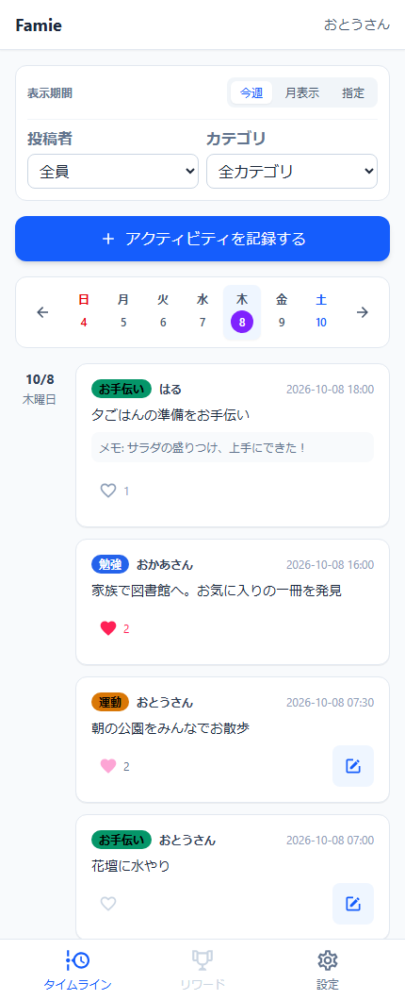

# Famie

**Small moments. Shared as a family.**

Famie is a simple place to record everyday activities, see what your family has been doing, and encourage one another with a heart. From finishing homework to helping with dinner, ordinary moments deserve a little recognition.

**Visit Famie: [famie.ka2.org](https://famie.ka2.org)**

## A little encouragement, every day

- **Keep a family timeline.** Record an activity with a date, category, and optional note.
- **Celebrate each other.** Like another family member's activity, see the hearts it receives, and undo your own like whenever you want.
- **Find the moments you need.** Browse by week or month, or filter by date range, family member, and category.
- **Make it your family's space.** Family administrators manage members and categories. Each person edits their own activity records.
- **Feel at home on your phone.** Add Famie to your home screen as a PWA, choose a light or dark theme, and customize your display name and header suffix.

  

*Illustrative sample data from v0.13.0. The app interface is in Japanese.*

## Made for families

An administrator creates a family and adds its members. Activities and categories stay within that family, with administrator and regular-member roles. Each account currently belongs to one family.

Rewards and membership in multiple families are planned features; they are not available yet. Famie does not process payments.

## Built with

Nuxt 4, Vue, TypeScript, and Tailwind CSS on the frontend; Laravel, Sanctum, and PostgreSQL on the backend.

For setup, commands, repository structure, and reproducing the sample screenshot, see the [development guide](docs/development/workspace-guide.md).

- [Documentation](docs/README.md)
- [Requirements and release status](docs/issues/summary.md)
- [v0.13.0 specification](docs/issues/v0.13.0.md)
- [Contributor and agent instructions](AGENTS.md)
