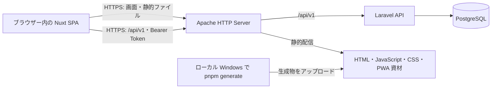
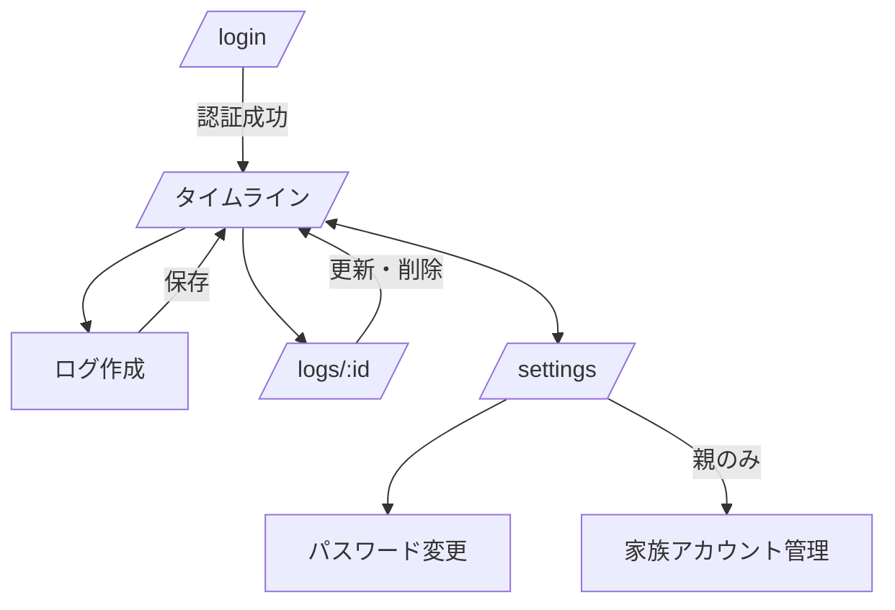
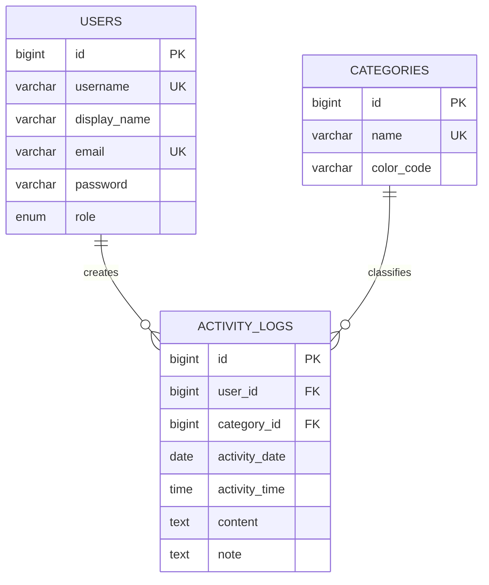

# Famie 基本設計書

## 1. 文書概要

| 項目 | 内容 |
| --- | --- |
| 文書名 | Famie 基本設計書 |
| 版数 | 1.1 |
| 対象フェーズ | 初期リリース |
| 作成日 | 2026-09-21 |
| 更新日 | 2026-09-22 |
| 関連文書 | `fixed_requirements.md` |

本書は Famie の外部仕様および主要な内部構成を定義する。詳細なクラス実装、マイグレーション、画面コンポーネントの実装手順は本書の対象外とする。

## 2. システム構成

### 2.1 技術構成

| 区分 | 採用技術 | 役割 |
| --- | --- | --- |
| フロントエンド | Nuxt 4、Vue、Tailwind CSS | SPA のブラウザー描画、PWA、API 呼出し |
| PWA | `@vite-pwa/nuxt` | Manifest、Service Worker、ホーム画面追加 |
| バックエンド | PHP 8.4、Laravel 11 以降 | REST API、認証、認可、入力検証 |
| 認証 | Laravel Sanctum | Bearer Token の発行と検証 |
| データベース | PostgreSQL 14.13 | アプリケーションデータの永続化 |
| Web サーバー | Apache HTTP Server | HTTPS 終端、IP 制限、静的ファイル配信、Laravel 公開 |
| ビルド環境 | ローカル Windows、Node.js、pnpm | Nuxt SPA の静的ファイル生成 |
| インフラ | 契約中の CoreServer、`famie.ka2.org` | 本番実行環境。Node.js の常駐プロセスは禁止 |

契約環境で Apache、PHP 8.4、PostgreSQL 14.13 が利用可能であり、Laravel API の稼働実績があることを前提とする。

### 2.2 論理構成



Apache は Nuxt の静的生成物を配信し、`/api/v1` は Laravel の `public/index.php` へルーティングする。ブラウザーから同一 Origin の API を呼び出す構成とし、本番の Nuxt サーバーおよび Nuxt 向けリバースプロキシは使用しない。

### 2.3 描画・データ取得方式

- Nuxt は `ssr: false` とし、`frontend` で既存の `pnpm generate` を実行して `.output/public` に配信ファイルを生成する。
- 静的配信するのは SPA の共通画面コードと資材であり、ログ ID ごと・利用者ごとの HTML を事前生成しない。
- 認証、活動ログ、ユーザー、カテゴリのデータはブラウザーから Laravel API を呼び出して取得・更新する。ビルド時に家族データやトークンを生成物へ埋め込まない。
- データ更新後は API を再取得して表示へ反映する。再ビルドはフロントエンドのコード・資材・ビルド時設定の変更時に行う。
- Nuxt のサーバー API やサーバーミドルウェアに本番機能を依存させず、サーバー処理は Laravel に実装する。

## 3. 認証・認可設計

### 3.1 認証方式

1. クライアントは `POST /api/v1/auth/login` に `login` と `password` を送信する。
2. Laravel は `username` または `email` で利用者を検索し、ハッシュ化済みパスワードを照合する。
3. 成功時に Sanctum の Personal Access Token と利用者情報を返す。
4. ブラウザー内の Nuxt はトークンを `auth_token` Cookie に保持し、以後の API 呼出しで `Authorization: Bearer <token>` を付与する。
5. 保護対象画面の初回表示・再読み込み時は、トークンがなければ `/login` へ遷移し、トークンがあれば `/auth/me` で利用者を確認してからデータ取得・画面表示を行う。
6. API が 401 を返した場合、Nuxt はトークンと利用者の状態を破棄して `/login` へ遷移する。通信失敗は未認証と区別し、日本語のエラーを表示する。

Cookie は本番で `Secure`、`SameSite=Lax`、`Path=/` を設定する。ブラウザーの JavaScript が Bearer Token を読み出す方式のため HttpOnly は使用しない。静的ファイルの取得自体はログインを要求しないが、家族データの参照・変更はすべて Laravel の認証・認可を通す。

トークンの有効期間は 30 日を初期値とする。ログイン時に当該利用者の既存トークンを無効化するため、同時に有効なログイン状態は 1 つとする。

### 3.2 認可マトリクス

| リソース・操作 | 親（`parent`） | 子（`child`） | 制御方式 |
| --- | --- | --- | --- |
| ログ一覧・詳細の参照 | 許可 | 許可 | `ActivityLogPolicy` |
| ログの新規作成 | 自分のログのみ | 自分のログのみ | サーバー側で `user_id` を設定 |
| ログの更新・削除 | 全件許可 | 自分のログのみ | `ActivityLogPolicy` |
| ユーザー一覧の参照 | 許可 | 許可 | 認証ミドルウェア |
| ユーザー作成・編集・削除 | 許可 | 拒否 | ロール判定 |
| パスワード変更 | 自分または他者 | 自分のみ | 対象ユーザーとロール判定 |
| カテゴリ一覧の参照 | 許可 | 許可 | 認証ミドルウェア |
| カテゴリ追加・更新・削除 | 許可 | 拒否 | ロール判定 |

認可は画面の表示制御だけに依存せず、すべての変更 API で Laravel の Policy またはロール判定により強制する。

### 3.3 IP 制限

- `ALLOWED_IPS` 環境変数にカンマ区切りで許可 IP アドレスを設定する。
- API は Apache の `Require ip` と Laravel の `RestrictIpAddress` ミドルウェアの二層で遮断する。静的ファイルは Apache で遮断する。
- 許可リストが空、またはクライアント IP が一致しない場合は HTTP 403 を返す。
- HTML、JavaScript、CSS、Manifest、Service Worker、アイコンおよび API の全経路を保護対象とする。
- `ALLOWED_IPS` を正本とし、デプロイ時および許可 IP 変更時に Apache の許可設定へ同期する。Laravel の `.env` は Apache が自動で読み込むものとは扱わない。空の場合は Apache も `Require all denied` とする。
- Laravel は実際の接続元 IP を使用する。ホスティング環境にプロキシがある場合のみ、その信頼済みプロキシからの転送ヘッダーを使用し、任意の `X-Forwarded-For` を信用しない。
- IP 制限はサーバーへのリクエストに適用する。ブラウザーに取得済みの共通画面資材が残る場合も、家族データはキャッシュせず API への接続と認証を必須とする。

## 4. 画面設計

### 4.1 画面一覧

| 画面 ID | 画面名 | パス | 主な機能 | 利用者 |
| --- | --- | --- | --- | --- |
| SCR-01 | ログイン | `/login` | ユーザー名またはメールアドレスとパスワードによる認証 | 未認証利用者 |
| SCR-02 | タイムライン | `/` | 一覧、期間・投稿者・カテゴリ絞り込み、ログ作成起動 | ログイン済み利用者 |
| SCR-03 | ログ作成 | `/logs/create` または作成モーダル | カテゴリ、日付、時刻、内容、メモの入力 | ログイン済み利用者 |
| SCR-04 | ログ詳細・編集 | `/logs/:id` | 詳細表示、権限に応じた更新・削除 | ログイン済み利用者 |
| SCR-05 | 設定・ユーザー管理 | `/settings` | 自分のパスワード変更、家族一覧、親の管理操作 | ログイン済み利用者 |

### 4.2 画面遷移



### 4.3 共通 UI 方針

- `default` レイアウトにヘッダーとボトムナビゲーションを配置する。
- ボトムナビゲーションはタイムラインと設定を提供する。
- 一覧の初期表示期間は当週の月曜日から日曜日までとする。
- 指定期間では開始日・終了日を入力し、開始日が終了日より後の場合は API 呼出し前にエラー表示する。
- 権限のない編集・削除操作は UI に表示しない。ただし API 側の認可を必須とする。
- 作成、更新、削除、通信失敗の結果は日本語メッセージで通知する。

### 4.4 SPA の URL と PWA

- `/login`、`/settings`、`/logs/:id` などへの直接アクセス・再読み込み時は、Apache が SPA の `index.html` を返し、ブラウザーのルーターが画面を選択する。
- `/api` 配下は SPA フォールバックから除外して Laravel へ渡し、API の 401・403・404・422 などを HTML に置き換えない。存在しない静的資材は 404 とする。
- 存在しない画面は SPA で未検出として表示し、存在しないログは API の 404 に応じて案内する。
- Service Worker は共通の静的資材のみをキャッシュ対象とする。API 通信はキャッシュせずネットワークへ送り、画面用のナビゲーションフォールバックからも `/api` 配下を除外する。
- オフラインでは家族データの取得・投稿・更新を行わず、通信エラーを表示する。下書き保存、送信キュー、再同期は実装しない。
- HTML と Service Worker の更新が反映される配信設定とし、デプロイ後は既存の PWA 利用者にも新しい資材が適用されることを確認する。

## 5. API 基本設計

### 5.1 共通仕様

| 項目 | 仕様 |
| --- | --- |
| ベースパス | `/api/v1` |
| データ形式 | JSON |
| 文字コード | UTF-8 |
| 認証 | `Authorization: Bearer <token>` |
| 成功時 | 200、201 または 204 |
| 未認証 | 401 |
| 権限なし | 403 |
| 未検出 | 404 |
| 入力不正 | 422 |
| サーバー異常 | 500 |

更新 API は `PUT`、削除 API は `DELETE` を用いる。リソース一覧のレスポンスは Laravel のページネーション形式とし、`data`、`links`、`meta` を含める。

### 5.2 エンドポイント一覧

| メソッド | パス | 用途 | 権限 |
| --- | --- | --- | --- |
| POST | `/auth/login` | ログイン、トークン発行 | IP 許可済み |
| POST | `/auth/logout` | 現在トークンの破棄 | 認証済み |
| GET | `/auth/me` | 現在の利用者情報 | 認証済み |
| GET | `/users` | 家族ユーザー一覧 | 認証済み |
| POST | `/users` | 家族アカウント作成 | 親 |
| PUT | `/users/{id}` | 家族アカウント編集 | 親 |
| DELETE | `/users/{id}` | 家族アカウント削除 | 親 |
| PUT | `/users/{id}/password` | パスワード変更・リセット | 本人または親 |
| GET | `/categories` | カテゴリ一覧 | 認証済み |
| POST | `/categories` | カテゴリ作成 | 親 |
| PUT | `/categories/{id}` | カテゴリ更新 | 親 |
| DELETE | `/categories/{id}` | カテゴリ削除 | 親 |
| GET | `/logs` | 活動ログ一覧 | 認証済み |
| POST | `/logs` | 活動ログ作成 | 認証済み |
| GET | `/logs/{id}` | 活動ログ詳細 | 認証済み |
| PUT | `/logs/{id}` | 活動ログ更新 | 親または投稿者 |
| DELETE | `/logs/{id}` | 活動ログ削除 | 親または投稿者 |

### 5.3 主要 API の入出力

#### ログイン

`POST /api/v1/auth/login`

```json
{
  "login": "parent1",
  "password": "password"
}
```

```json
{
  "message": "ログインに成功しました。",
  "access_token": "1|...",
  "token_type": "Bearer",
  "user": {
    "id": 1,
    "username": "parent1",
    "display_name": "おとうさん",
    "role": "parent"
  }
}
```

#### 活動ログ一覧

`GET /api/v1/logs?from=2026-09-01&to=2026-09-30&user_id=1&category_id=2&page=1`

| クエリ | 型 | 必須 | 内容 |
| --- | --- | --- | --- |
| `from` | date | 任意 | 開始日、`Y-m-d` |
| `to` | date | 任意 | 終了日、`Y-m-d` |
| `user_id` | integer | 任意 | 投稿者 ID |
| `category_id` | integer | 任意 | カテゴリ ID |
| `page` | integer | 任意 | ページ番号 |

#### 活動ログ作成・更新

```json
{
  "category_id": 2,
  "activity_date": "2026-09-21",
  "activity_time": "18:30",
  "content": "食器を片付けた",
  "note": "家族で分担した"
}
```

`category_id`、`activity_date`、`content` は必須とする。`activity_time` は `H:i`、`content` と `note` は最大 1,000 文字とする。作成時に送信された `user_id` は受け付けず、認証ユーザーを投稿者に設定する。

## 6. データベース設計

### 6.1 ER 構造



### 6.2 テーブル定義

#### `users`

| カラム | 型 | NULL | 制約・説明 |
| --- | --- | --- | --- |
| `id` | bigint | 不可 | 主キー |
| `username` | varchar(255) | 不可 | 一意、ログイン ID |
| `display_name` | varchar(255) | 不可 | 画面表示名 |
| `email` | varchar(255) | 可 | 一意、ログインに使用可能 |
| `password` | varchar(255) | 不可 | ハッシュ値 |
| `role` | enum | 不可 | `parent` または `child`、既定値は `child` |
| `remember_token` | varchar(100) | 可 | Laravel 標準 |
| `created_at` / `updated_at` | timestamp | 不可 | 作成・更新日時 |

#### `categories`

| カラム | 型 | NULL | 制約・説明 |
| --- | --- | --- | --- |
| `id` | bigint | 不可 | 主キー |
| `name` | varchar(255) | 不可 | 一意、カテゴリ名 |
| `color_code` | varchar(7) | 不可 | Hex カラーコード、既定値 `#3B82F6` |
| `created_at` / `updated_at` | timestamp | 不可 | 作成・更新日時 |

#### `activity_logs`

| カラム | 型 | NULL | 制約・説明 |
| --- | --- | --- | --- |
| `id` | bigint | 不可 | 主キー |
| `user_id` | bigint | 不可 | `users.id` への外部キー、ユーザー削除時は連鎖削除 |
| `category_id` | bigint | 不可 | `categories.id` への外部キー、カテゴリ削除を制限 |
| `activity_date` | date | 不可 | 実施日 |
| `activity_time` | time | 可 | 実施時刻 |
| `content` | text | 不可 | 活動内容 |
| `note` | text | 可 | 補足メモ |
| `created_at` / `updated_at` | timestamp | 不可 | 作成・更新日時 |

`activity_logs` には一覧検索のため、`(activity_date, user_id)` の複合インデックスを作成する。

### 6.3 初期データ

| カテゴリ名 | カラーコード |
| --- | --- |
| 勉強・宿題 | `#3B82F6` |
| 家事・お手伝い | `#10B981` |
| 運動・スポーツ | `#F59E0B` |
| 習い事 | `#8B5CF6` |
| 健康・生活 | `#EC4899` |
| 外出・おでかけ | `#06B6D4` |
| その他 | `#6B7280` |

本番用の初期親アカウントは、固定パスワードを含む Seeder ではなく、デプロイ時に安全な値で作成する。

## 7. 配置・運用設計

### 7.1 本番配置

| コンポーネント | 配置・公開方法 |
| --- | --- |
| Nuxt | ローカルで生成した `frontend/.output/public` の内容を Apache の静的公開領域へ配置 |
| Laravel | 契約環境の PHP 8.4 で実行し、`public` のみを公開対象として `/api/v1` を処理 |
| PostgreSQL | 契約環境の PostgreSQL 14.13 を利用し、Laravel から接続。ブラウザーから直接接続しない |
| Apache | HTTPS、全経路の IP 制限、静的配信、SPA フォールバック、Laravel への API 振り分け |

CoreServer の Apache を本番 Web サーバーとして使用する。契約環境の HTTPS、IP 制限、`mod_rewrite` およびヘッダー設定機能を利用する。Nuxt 用の `mod_proxy`、`mod_proxy_http`、PM2 および本番 Node.js は不要とする。配置先の絶対パスは契約環境の公開ディレクトリに合わせ、VPS のディレクトリ構成や管理者権限を前提としない。

Apache の振り分けは、IP 制限を適用したうえで API、実在する静的ファイル、SPA の画面 URL の順に処理する。API は元のパス・クエリ・HTTP メソッド・Authorization ヘッダーを保持して Laravel の `public/index.php` へ渡す。Laravel の `.env`、ソース、`vendor` などは静的公開領域へ配置しない。

ローカルで `pnpm generate` を実行する前に、本番用 API ベースを `/api/v1` に設定する。生成後は `.output/public` の内容をアップロードし、Apache のルーティング・IP 制限設定を適用する。`.output/server`、`node_modules` および開発用 `.env` はフロントエンドの配信対象に含めない。サーバー上での Nuxt ビルド・起動は行わない。

### 7.2 ローカル開発環境

| コンポーネント | 構成 |
| --- | --- |
| OS | Windows |
| Web サーバー・PHP | カスタムした XAMPP の Apache と PHP 8.4.24 以上 |
| Laravel | XAMPP の Apache VirtualHost 配下で実行し、DocumentRoot は Laravel の `public` に設定 |
| PostgreSQL | XAMPP には含めず、Windows に個別インストールしてローカル接続 |
| Nuxt | pnpm で起動し、通常は `http://localhost:3000` で実行 |

ローカルの Laravel VirtualHost は `mod_rewrite` を有効にし、`AllowOverride All` を設定する。開発時は Nuxt の開発サーバーから Laravel API を呼び出すため、Laravel 側の CORS 設定でローカル Nuxt の Origin を許可する。開発サーバー利用中に同一 Origin とする場合は、ローカル Apache の `mod_proxy` を利用できる。

本番相当の確認では、ローカルで生成した `.output/public` を Apache から配信し、同一 Origin の `/api/v1` を Laravel へ振り分ける。Nuxt の開発サーバーを停止した状態で、画面 URL の直接アクセス、認証、API 操作、IP 制限および PWA を確認する。PWA の確認は HTTPS またはブラウザーが安全なコンテキストとして扱う localhost で行う。

### 7.3 環境変数

| 変数 | 用途 |
| --- | --- |
| `APP_ENV` | 実行環境。本番は `production` |
| `APP_DEBUG` | 本番は `false` |
| `APP_URL` | `https://famie.ka2.org` |
| `DB_CONNECTION` | `pgsql` |
| `DB_HOST` / `DB_PORT` | PostgreSQL 接続先 |
| `DB_DATABASE` / `DB_USERNAME` / `DB_PASSWORD` | DB 接続情報 |
| `ALLOWED_IPS` | 許可するクライアント IP の一覧。Laravel で使用し、Apache 設定にも同期 |
| `NUXT_DEV_API_BASE` | Nuxt 開発サーバーから呼び出す API URL。本番生成物では使用しない |

本番生成物の API ベースは同一 Origin の `/api/v1` に固定する。`NUXT_DEV_API_BASE` は開発時だけ使用し、DB 接続情報や API トークンなどの秘密情報を Nuxt の公開設定に含めない。

### 7.4 バックアップと監視

- PostgreSQL の定期ダンプをアプリケーションとは別の保存先へ保管する。
- 本番デプロイ前にバックアップからの復元を検証する。
- 契約環境で参照可能な Apache・PHP・Laravel のログと、PostgreSQL への接続状態を確認可能にする。フロントエンドはブラウザーのエラーと静的ファイル・API の HTTP 応答で調査する。
- TLS 証明書は契約環境で提供される管理方法に従い、更新と有効期限を確認する。Certbot の常駐・管理者権限を前提としない。
- フロントエンドの生成物はリリース単位で保管し、配置失敗時に直前の生成物へ戻せるようにする。HTML と資材の不整合を避け、更新後に画面の直接アクセスと PWA の更新を確認する。

## 8. 実装上の整合事項

- `PUT /users/{id}/password`、ユーザー編集・削除、カテゴリ更新・削除は、既存の一部実装例に含まれていなくても本設計の API 契約として実装する。
- `GET /categories` およびカテゴリ変更 API は、認証ミドルウェア配下に置く。
- `activity_time` が未設定のログは、一覧で空欄として表示する。
- ページネーションで後続ページを取得できる UI を実装し、初期表示だけで全ログを読み切る設計にしない。
