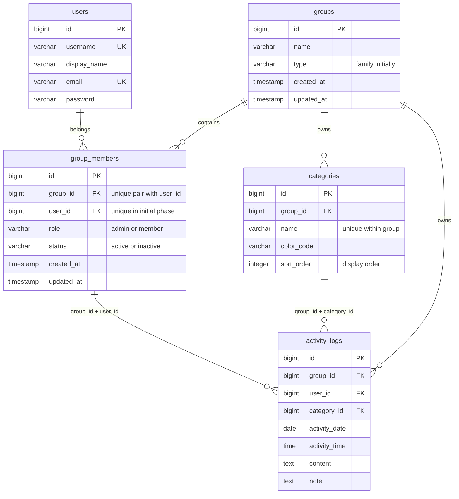

# グループ対応・モデル拡張設計案

2026-09-28。`.tools/ka2_idea.md`を[現行モデル仕様](knowledge/current-data-model-spec.md)と照合して具体化した対話用の案。**未合意の設計を含む。migration・モデル・APIはまだ変更しない。** v0.9.0は設計までとし、実装は後続版で扱う。

2026-10-01レビュー：ユーザーがv0.9.0の設計タスクとして定義範囲・粒度を承認。本版の設計成果物は完了。登録超過後の待機時間の暫定初期値、リワード詳細、配置実環境の検証は後続工程へ引き継ぎ、全機能の詳細設計・実装完了とは区別する。

## 1. 素案から引き継ぐ考え方

- 認証情報を持つ`users`と、グループへの所属・役割を持つ中間テーブルを分ける。
- グループの名称・種別を管理し、家族以外へ拡張できる名前を検討する。
- `activity_logs`自身にグループIDを持たせ、一覧・集計の分離基準とする。
- ユーザー名・メールの一意性は全体で維持し、カテゴリ名の一意性はグループ単位へ変更する。
- 現行のユーザー・カテゴリ・履歴IDを保持して段階移行し、最後に`users.role`を削除する。

## 2. 判断事項と推奨案

| ID | 論点 | 推奨案 | 状態 |
| --- | --- | --- | --- |
| D1 | 名称・権限語彙 | `groups` / `group_members`。内部はadmin/member、family画面では親/子と表示 | 2026-09-28 合意済み |
| D2 | 複数所属 | 中間テーブルを採用するが初期提供は単一所属。追加所属・切り替えは後続 | 2026-09-28 合意済み |
| D3 | 初期カテゴリ | グループ作成時にプリセットをコピーし、通常カテゴリとして所有 | 2026-09-28 合意済み |
| D4 | 削除と履歴 | 日常操作では所属を無効化し、ユーザー・所属・履歴を連鎖削除しない | 2026-09-29 合意済み |
| D5 | 未使用プロフィール列 | 型・責務を設計に残し、実際の列追加は利用機能と同時に行う | 2026-09-29 合意済み |
| D6 | グループコンテキスト | 業務APIのパスにgroup_idを明示し、毎リクエストで所属確認 | 2026-09-29 合意済み |
| D7 | 既存データの移行先 | 既存全ユーザー・カテゴリ・履歴を一つのグループへ移す | 2026-09-29 合意済み。名称は実行前に指定 |
| D8 | カテゴリ並び順 | sort_order列でグループ共通の表示順を保持 | 2026-09-29 合意済み。実装版は別途決定 |

D1〜D8の基本方針はユーザー回答により確定。リワードの詳細、切替時の認証互換、実装時期などの未決事項は別途管理する。中間テーブルの採用により以前の「中間テーブルを先行実装しない」方針を見直した。v0.9.0で機能実装しない点は変わらない。

### 命名と役割

`groups`は利用者が所属する業務概念を表し、`tenant`はアクセス分離の説明用語として使う。`families`でも現在の機能は表せるが、家族以外を含めるという素案には`groups`が合う。

権限はグループ種別に依存しない`admin` / `member`を推奨する。家族の画面で親／子と訳し、将来のorganizationでは管理者／メンバーと訳す。自由なrole文字列は未知の権限や判定漏れを招くため、許可値を制約する。parent/childを選ぶ場合も自由文字列にはせず、許可値を限定する。

## 3. 推奨モデルのER図

ER図は将来の複数所属も表現するが、D2の推奨案では初期段階の`UNIQUE(user_id)`によって1ユーザー最大1所属とする。新規登録は所属まで原子的に作成するため、利用可能なユーザーは1所属を持つ。0所属は正常利用状態とせず、認証後の業務アクセスを拒否する。時刻・作成更新日時など既存列の詳細は現行仕様から引き継ぐ。

## 4. テーブルと制約

### groups（新規）

| 列 | 型 | NULL | 既定値・意味 |
| --- | --- | --- | --- |
| id | bigint | 不可 | PK、シーケンス採番 |
| name | varchar(255) | 不可 | API上限50文字、前後空白除去、空白のみ不可。一意にはしない |
| type | varchar(50) | 不可 | `family`。初期はfamilyのみ許可 |
| created_at / updated_at | timestamp | 可 | 既存の日時方針に合わせる |

organization/schoolの予約値を今からAPIで許可しない。種別追加時に表示・初期カテゴリ・役割ラベルを合わせて定義する。typeは権限を付与する値ではない。初期リリースではグループ削除・種別変更・移動機能を提供しない。

### group_members（新規）

| 列 | 型 | NULL | 既定値・意味 |
| --- | --- | --- | --- |
| id | bigint | 不可 | PK |
| group_id | bigint | 不可 | groups.id |
| user_id | bigint | 不可 | users.id |
| role | varchar(50) | 不可 | member。許可値admin/member。登録者だけサーバーがadminを設定 |
| status | varchar(20) | 不可 | active。許可値active/inactive |
| created_at / updated_at | timestamp | 可 | 既存方針 |

- `UNIQUE(group_id, user_id)`：同じユーザーの二重所属を防ぐ。履歴の複合外部キーの参照先にも使う。
- 初期は`UNIQUE(user_id)`も追加し、API外からの複数所属も拒否する。inactive所属も数え、別グループへの移籍には使わない。
- group_id → groups.id、user_id → users.idはともに`ON DELETE RESTRICT`を提案する。所属行の消去は、履歴の所在や権限の追跡に影響するため通常操作から行わない。
- 少なくとも1人のactive adminを維持する。最後のadminの降格・無効化は拒否。対象グループの行ロックを取得して確認・更新し、同時変更でadminが0人になる競合を防ぐ。
- roleは所属の属性として更新する。`User::isParent()`の単純置換ではなく、対象グループでactiveな所属と権限を確認する。

### users（変更）

`role`は移行検査と切替後に削除する。ログインID、表示名、メール、パスワード、既存IDと一意制約は維持する。ユーザー名・メールはログインに使うためグループ単位へ緩和しない。表示名も当面ユーザー全体の属性とする。

素案の追加列は以下の候補として残す。**D5の合意により、利用機能の実装時に追加する。型・用途・権限はその時点で確定し、APIの受入項目へ自動追加しない。**

| 候補列 | 型案 | 初期値 | 先に定義すべき用途 |
| --- | --- | --- | --- |
| avatar | varchar(2048) | NULL | アップロード資産の保存キー。URL・公開範囲・削除連動は画像機能で決定 |
| birth_date | date | NULL | 本人・親の更新可否と閲覧範囲。年齢制限等に使うならその仕様 |
| phone_number | varchar(32) | NULL | 数値にはしない。国番号・正規化・確認済み状態の要否 |
| user_meta | jsonb | NULL | ルートをJSONオブジェクトに限定する案。許可キー・容量・閲覧範囲 |

メタ情報にrole・group_id・認証状態・報酬条件を逃がさない。検索・一意制約・権限判定が必要な情報は専用属性として設計する。未使用列を今追加してもアクセス仕様は決まらないため、必要になる機能と合わせて追加する。

#### D5：追加時期の比較（2026-09-29）

| 方式 | メリット | デメリット |
| --- | --- | --- |
| モデル拡張時に先行追加 | 複数列のDDL・配置確認をまとめられる。型が確定していれば後続開発の前提を揃えられる | 用途変更で型・制約を再変更する可能性。未使用列の管理と意図の説明が必要。APIの公開・更新許可は別途必要で、機能実装の作業がなくなるわけではない |
| 利用機能と同時に追加 | 用途・型・検証・閲覧権限を一緒に決められる。不要な列を作らずに済む | 機能ごとにmigration・配置検証が必要。既存行の初期値・バックフィルと旧版互換をその都度確認する |

今回の4列は用途・権限が未確定なので、利用機能と同時の追加を採用した（2026-09-29合意）。NULL許容列の追加をまとめても将来のmigration全体が不要になるわけではない。

### categories（変更、D3コピー案）

- `group_id bigint NOT NULL`を追加、groups.idへRESTRICT。
- `UNIQUE(name)`を`UNIQUE(group_id, name)`へ変更する。大文字小文字などの比較規則は現行DBの方針を維持し、新たな正規化は別途合意する。
- 履歴からの参照用に`UNIQUE(group_id, id)`を追加する。id単独のPKは維持する。
- 新グループ作成時、プリセット7件をグループ所有の行としてコピーする。名前・色のその後の変更は他グループへ影響しない。
- 初期カテゴリのコピーはグループ作成と同一トランザクションで一度だけ実施する。通常配置で既存グループへ再投入しない。削除・改名済みのカテゴリが復活することを避ける。
- 現行CategorySeederと通常配置時の呼び出しを変更対象に含める。現在の`firstOrCreate(name)`をそのまま残さない。
- プリセット管理専用テーブルは初期には不要。既存の定義を再利用する。後日、運用者が編集する要件が生じた場合に分離する。

#### D8：カテゴリの並び順（2026-09-29合意）

並び順をcategoriesに保持する方針を設計対象に含める。列名は`sort_order`を採用する。ORDERはSQLの予約語であり、引用識別子への依存を避け、表示順という用途も明確にできる。[PostgreSQL予約語一覧](https://www.postgresql.org/docs/current/sql-keywords-appendix.html)参照。

- `sort_order integer NOT NULL CHECK (sort_order >= 1)`。固定の既定値は設けず、作成処理がグループ内の末尾の値+1を設定する。
- グループ共通の順序とし、変更できるのはactive adminだけ。個人別の順序は初期対象外。
- 一覧・登録編集時の選択肢・絞り込みを`sort_order ASC, id ASC`へ統一する。活動履歴そのものの時系列順は変えない。
- 順序値には一意制約を設けず、同値でもidで安定順とする。並び替えAPIは全件を1から振り直す。削除後の欠番は許容する。
- 新規グループではプリセット定義順に1〜7を付与。既存データは明示された現在の順序があれば保持し、順序未定義ならid昇順で初期化する案とする。
- `PUT /groups/{group}/categories/order`へ、そのグループの全カテゴリIDを希望順で送る案。重複・他グループID・欠落を拒否し、全体をトランザクションで更新する。通常のカテゴリ更新からsort_orderを直接書き換えさせない。
- 作成・削除・並び替えで共通のグループ行ロックを取得する。同時の並び替えは後に確定した全体順を採用する案。追加・削除によってID集合が変わっていた場合は409で再読込を求める。
- 索引`(group_id, sort_order, id)`を候補とする。カテゴリ数と実行計画で必要性を確認する。
- 課題11-Bとして設計を具体化し、列・API・UIの実装版は別途決める。v0.9.0では追加しない。

#### D3の不採用案：共有カテゴリを直接参照する場合

素案の`group_id=NULL`を共有プリセットとして扱う方式も可能。ただし次の追加仕様が必要になる。

1. 通常の`UNIQUE(group_id, name)`だけでは、group_idがNULLの同名プリセット重複を防げない。共有行だけを対象にする`UNIQUE(name) WHERE group_id IS NULL`相当の一意索引を別途設ける。[PostgreSQLの一意制約](https://www.postgresql.org/docs/current/ddl-constraints.html#DDL-CONSTRAINTS-UNIQUE-CONSTRAINTS)・[部分索引](https://www.postgresql.org/docs/current/indexes-partial.html)参照。
2. 一覧・検証は「現在のグループ、または共有」の範囲。共有カテゴリの編集・削除はすべての一般グループ管理者へ禁止する。
3. 共有とローカルで同名が存在した場合、初期案は両方を表示して共有ラベルで区別する。上書き・非表示・個別変更を望む場合は追加仕様が必要。
4. 「カテゴリが同じグループ、または共有」という条件は、通常の複合外部キーだけでは表現できない。API検証に加えDBトリガーを使うか、DBでの所属一致保証を部分的に諦めるかの判断が必要。他行を参照するCHECK制約では代用しない。[PostgreSQLのCHECK制約](https://www.postgresql.org/docs/current/ddl-constraints.html#DDL-CONSTRAINTS-CHECK-CONSTRAINTS)参照。
5. 共有カテゴリの変更が過去履歴の表示へ全体的に波及する。共有は原則不変として廃止は新規選択の停止で扱う案とし、履歴参照を残す。共有化・グループ間移動も禁止する。

グループごとの編集自由度とDBの整合性を優先して、主案ではコピー方式を推奨する。共有方式を選んだ場合は上記論点を解決してから確定する。

### activity_logs（変更）

- `group_id bigint NOT NULL`を追加し、groups.idをRESTRICTで参照。
- `(group_id, user_id)` → `group_members(group_id, user_id)`、`(group_id, category_id)` → `categories(group_id, id)`の複合外部キーをRESTRICTで設定する。
- グループIDを追加するだけでは、他グループのユーザーやカテゴリを誤って参照できる。複合外部キーで、この組み合わせの不整合も防ぐ。
- 現行`user_id → users.id ON DELETE CASCADE`は除去し、所属経由の参照に置き換える。投稿者の物理削除による履歴消失を防ぐ。カテゴリの単独FKは複合FKへの置換後に整理する。
- ID・user_id・category_id・日時・本文・メモは保持する。group_idとuser_idは登録時にサーバーで決め、更新APIでは変更不可。
- 一覧用`(group_id, activity_date, user_id)`を採用する。複合FKの参照元とユーザー絞り込み向けに`(group_id, user_id)`、カテゴリ参照検査向けに`(group_id, category_id)`も候補とし、PostgreSQLの実行計画で確認する。旧索引は新索引とクエリの確認後に除去する。
- 所属のinactive化後も既存のactivity_logsをDBに保持する。タイムライン・件数・詳細では非表示とし、再有効化時に再表示する。活動の作成・編集はAPIでactive所属を確認する。

## 5. グループコンテキストとAPI権限

### コンテキストの確定（D6推奨案）

公開APIの基準は`/api/v1`。業務APIを`/groups/{group_id}/...`へ揃える。group_idはアクセス権の証明ではなく対象の指定であり、リクエストごとに認証ユーザーのactive所属を確認する。グループを跨ぐフォールバックを設けない。

- 認証トークンはユーザーを識別する。roleや現在グループをトークンに固定しない。
- `/auth/me`はユーザー属性と所属情報（id/group_id/name/type/role/status）を返す。旧トップレベルのroleをグローバル権限として残さない。
- 初期は唯一のactive所属をUIが使用する。0件は利用不可、想定外の複数件は409等で明示的に止め、先頭の所属を勝手に選ばない。
- グループIDの検証 → 同グループ内でリソース解決 → 操作権限確認の順とする。他グループのIDと存在しないIDはいずれも404とし、存在を漏らさない。
- 一覧フィルターのユーザー・カテゴリにも所属確認を適用する。範囲外のフィルターは422で拒否し、存在有無を区別しない。
- 保存時はメンバーの無効化・権限変更との競合を考慮し、必要な所属行をロックして再確認する。トークンに古い権限が残る運用にしない。

### 権限表（有効な同グループ所属が前提）

| 操作 | admin（親） | member（子） | 備考 |
| --- | --- | --- | --- |
| メンバー・カテゴリ・履歴一覧／詳細 | 可 | 可 | 他グループは禁止、プロフィールの不要な個人属性は返さない |
| 自分の履歴作成／編集／削除 | 可 | 可 | グループも一致する本人のみ |
| 他者の履歴編集／削除 | 不可 | 不可 | 現行の本人限定方針を維持 |
| 新しいユーザー＋所属の作成 | 可 | 不可 | 初期は既存ユーザーIDによる追加所属を受け付けない |
| メンバーの役割変更・無効化 | 可 | 不可 | 自分の削除拒否を維持。最後のadminの消失は禁止 |
| カテゴリ作成／更新／削除 | 可 | 不可 | 使用済みカテゴリは削除不可 |
| 自分の表示名・パスワード変更 | 可 | 可 | グローバル認証API。自身のパスワード変更は現在値を確認 |
| 他メンバーのパスワード変更 | 初期の単一所属に限り現行方針を維持 | 不可 | 複数所属導入前に、グローバル資格情報へ及ぶ権限を再設計 |
| グループ削除・移籍・既存ユーザー招待 | 提供しない | 提供しない | 別機能として検討 |

役割・無効化のUI追加範囲は課題5と調整する。UIを追加しない段階でも、既存の更新・削除APIを旧来の全体権限や物理削除のまま残さない。

### 現行APIからの対応

| 現行 | 移行先案・扱い |
| --- | --- |
| `/status`、`/auth/login`、`/auth/logout` | 維持。active所属がない場合はログインを拒否し、トークンを発行しない |
| GET/PATCH `/auth/me` | 維持。roleを所属へ移し、本人属性だけを更新 |
| `/users`、`/users/{user}` | `/groups/{group}/members`、`/groups/{group}/members/{member}`。memberは所属行IDで解決 |
| `/users/{user}/password` | 本人は`/auth/me/password`、他者は`/groups/{group}/members/{member}/password`へ分離 |
| `/categories`、`/categories/{category}` | `/groups/{group}/categories`配下 |
| `/logs`、`/logs/{log}` | `/groups/{group}/logs`配下 |
| なし | POST `/auth/register`。親ユーザー・グループ・所属・初期カテゴリを原子的に作成 |

移行時は全トークンを失効し、全員再ログインとする（2026-10-01合意）。利用者4名への直接サポートを前提に、旧API互換期間と専用のPWA更新画面は設けない方針とする。ただし端末に残る旧版から手動で新版へ復旧できることを配置前に検証する。再ログインだけで古いJavaScriptが更新されるとは扱わない。詳細は移行計画を参照。

### 新規登録とメンバー追加

- 新規登録の入力はグループ名、ユーザー名、表示名、パスワード・確認、任意メール。type=familyとrole=adminはサーバー固定。group_id・roleの持ち込みを拒否する。
- 一つのトランザクションでユーザー、グループ、所属、初期カテゴリを作成し、失敗時に空グループ・孤立ユーザーを残さない。認証トークンは登録成功時だけ発行する。
- 新規ユーザー追加もユーザーと所属を一体で作成する。初期は親がparent/adminを追加できる現行方針も保持するが、必ず同じグループ内に限定する。
- 公開登録には下記のIP単位の試行制限を適用する。メール確認・招待・パスワード再発行は未提供のままであり、メール列があることを確認済み本人の証明に使わない。

## 6. 削除・失効の方針（D4合意済み）

### ログイン可否の補足（2026-09-29）

ユーザー行が存在することと、ログインを許可することを分ける。所属を無効化するだけでは現行の資格情報確認を通過し得るため、初期の単一所属では**active所属がちょうど1件あることをログイン成功の条件**に加える。論理削除列をusersへ重複して持たせる必要はない。

1. ログイン時、資格情報を確認した後、active所属を検査する。0件ならトークンを発行せず403と利用不可の案内を返す。資格情報が不正なら従来の認証失敗応答とし、所属状態を漏らさない。想定外の複数件も発行せず409とする。
2. 所属無効化と既存トークンの削除を同一トランザクションで行う。ログイン時の所属確認・トークン発行と無効化は共通の所属行ロックで直列化する。
3. 発行済みトークンでも全保護API（本人プロフィール等を含む）で利用可能な所属を確認する。書き込みは所属ロック取得後に再確認し、無効化後の更新を防ぐ。
4. フロントは失効応答を受けたらトークンと保持データを破棄しログイン画面へ戻す。すでに端末へ表示・配信済みの情報まで遡って消去できるものとは扱わない。

これにより初期段階では「ユーザーと履歴は残るが、再ログインも継続利用も不可」となる。将来複数所属になったら、別グループにactive所属がある場合はログイン可能とし、無効化されたグループへのアクセスだけを拒否する。ユーザー全体の利用停止は別の要件が発生した時点で設計する。D4はこの補足を含め2026-09-29に合意済み。

素案のCASCADEをそのまま採用すると、グループ／ユーザー削除で履歴と将来の獲得報酬が消える。初期はグループの物理削除を提供せず、通常のメンバー削除操作を所属のinactive化として扱う。

- 所属をinactiveにし、初期の単一所属アカウントでは既存の認証トークンを失効させる。ユーザー・所属・履歴は保持する。
- ユーザー・所属・既存活動記録は原則無期限で保持し、自動削除しない。ユーザー名・メールの一意制約を維持し、無効化を理由に解放・再利用しない（2026-10-01合意）。識別子の再利用禁止は新規登録の重複防止であり、本人のログイン拒否はactive所属の確認で保証する。
- 同じグループのactive adminが既存所属を再有効化できる（2026-10-01合意）。ユーザー・所属・活動記録のIDを保持し、古いトークンは復活させず本人が再ログインする。再有効化時も人数上限を確認する。
- 自分の削除は既存どおり拒否。最後のactive adminの無効化・降格も拒否する。
- 複数所属を解禁する際には「そのグループから外す」と「ユーザー全体の利用停止」を分離する。あるグループのadminが他グループ所属者のパスワードを変更できる現行方式を、そのまま持ち越さない。

### 表示と再有効化の入口（2026-10-01）

- 合意済み：無効化済みメンバーを、親・子双方のタイムラインの絞り込みプルダウンと設定画面の通常メンバーリストに表示しない。
- ここでいう活動記録（履歴）はactivity_logsの各行であり、例えば無効化前に登録した「9月30日・勉強・算数の宿題」のタイムラインカード、投稿者名、詳細、カレンダー上の件数を指す。ログイン履歴や監査ログではない。
- DBに保持することと通常画面に表示することは別である。「保持するためプルダウンにも必要」とした以前の説明は撤回する。投稿者名は記録から参照でき、選択肢への掲載は必須ではない。
- 合意済み：無効化済み投稿者の既存記録は全員表示を含むタイムライン・件数・詳細から非表示にする。一覧・集計・詳細APIに同じactive所属条件を適用し、詳細URLを直接指定しても404とする。DBには保持し、再有効化時に再表示する。親にも同じ条件を適用する。
- 合意済み：通常メンバーリストとは別に、管理者専用の「無効化済みメンバーを復元」を設ける。子には表示せずAPIも拒否し、他グループの所属は取得・変更できない。復元一覧は所属の復元用であり、非表示の活動記録を閲覧する例外にはしない。

### 上限と公開登録の試行制限（2026-10-01）

- 家族人数は既定10人、カテゴリ数は既定10個。環境変数からLaravel設定へ読み込み、サーバー側で検証する。設定名案はFAMIE_MAX_GROUP_MEMBERS / FAMIE_MAX_GROUP_CATEGORIES。正の整数のみ許可し、不正値で無制限にしない。
- 人数は登録者・親・子を含むactive所属の合計とする。inactiveは含めず、再有効化も追加と同じ上限検査を行う（合意済み）。
- カテゴリはプリセット7件を含むグループ所有の全件を数える（既定値なら追加可能数は3件）。使用中で削除できないカテゴリも数える。設定値がプリセット件数未満なら新規グループ作成を拒否し、部分作成を残さない。
- 上限を引き下げても既存データは消さず、上限を超える追加・再有効化を拒否する案。移行前検査で既存件数が上限を超えた場合は設定値を調整し、移行が勝手に削除・無効化しない。
- 人数・カテゴリの検査と追加はグループ行ロック下の同一トランザクションで行い、同時要求による上限超過を防ぐ。ロック取得順はグループ→所属（複数ならID昇順）→対象行に統一し、ログイン・無効化・復元・カテゴリ操作も逆順に取得しない。
- 公開登録の試行制限とは、未ログインの「新しい家族＋親アカウント作成」APIへの短時間の大量要求を抑える仕組み。家族人数・日々の活動登録回数の上限とは別。送信元IPごとに10分間5回（成功・失敗を含む）を初期仕様とし、同じ家庭の回線では枠を共有する（合意済み）。超過時は429とRetry-Afterを返す。計測期間・許可回数・超過後の待機時間を個別の環境変数で設定する。信頼するプロキシ設定は実装時に確認し、任意の転送ヘッダーによる制限回避を防ぐ。

#### 公開登録制限の設定と境界

| 環境変数名案 | 意味 | 初期値 |
| --- | --- | --- |
| FAMIE_REGISTER_WINDOW_SECONDS | 回数の計測期間 | 600秒（合意済み） |
| FAMIE_REGISTER_MAX_ATTEMPTS | 期間内の許可回数 | 5回（合意済み） |
| FAMIE_REGISTER_COOLDOWN_SECONDS | 超過を検出してからの待機時間 | 600秒を暫定初期値とする。待機時間の設定可能化は合意済み、初期値自体は未指定 |

実装方式は最初の受付要求から始まる固定窓とし、期間内の6回目は登録処理を実行せず待機状態へ移す。待機中の要求で解除時刻を延長しない。再試行可能時刻は計測窓の終了と待機終了の遅い方とし、Retry-Afterに実際の残秒数を返す。両方が終了した後の要求から新しい窓を開始する。設定は正の整数として検証する。

同一IPの並行要求でも許可回数を超えないよう、共有ストアで回数確認・加算・待機設定を原子的に処理する。認証済み管理者の家族メンバー追加は、この公開登録APIとは分ける。新規登録の試行制限は活動登録へ適用しない。

非表示・再表示はフロントだけでなくAPIで保証する。無効化済みユーザーIDを絞り込みクエリへ直接指定しても表示できない。復元後は同じIDの記録が再び一覧・件数・詳細に現れる。所属状態変更後に画面データを再取得し、別ユーザーへの再ログイン時は前ユーザーの保持データを破棄する。

## 7. リワードモデルへの接続（概念案）

今回の素案はグループ基盤を主題としているため、ここでは所有先・参照先を整理する。細かな付与ルールは未確定で、次の表はDDLではない。

| 概念 | 所有・参照 | 必要となる整合性 |
| --- | --- | --- |
| リワード定義 | group_id、名前、説明 | グループのadminだけが管理 |
| 条件の版 | 定義ID、期間ルール、目標回数、同日複数カウント可否、報酬説明 | 公開後の条件を上書きせず、変更は新しい版にする案 |
| 対象者 | 条件版ID、group_member_id | 定義と対象所属のグループを一致させる |
| 判定期間 | 条件版ID、開始・終了、タイムゾーン | nか月を評価可能な具体的区間へ展開する案 |
| 獲得履歴 | 条件版・期間・対象所属、獲得日時、条件／報酬のスナップショット | 単発付与案なら条件版×期間×対象所属の重複付与をDB一意制約で防ぐ |

- 対象者はユーザー個人だけでなくグループ内の所属へ紐づける。将来、別グループに属しても獲得履歴を混ぜない。
- インベントリはまず獲得履歴の閲覧画面として扱い、別の「所持数」テーブルは必要性を確認してから追加する。決済・送金は含めない。
- 同時登録でも付与は一度にする。編集・削除時の再評価、取り消し、条件変更、退会後の表示を決めてから実装する。
- 提案の出発点は「実施日で集計、対象者ごと、同日複数不可なら対象者×実施日を1回、1条件版・期間につき1報酬」。これは未合意である。
- 期間境界・月末・タイムゾーン、過去登録の遡及、繰り返し報酬、失効・受渡し済み、閲覧範囲、定義数・人数上限は次の対話で決める。

## 8. 将来の複数所属へ進む条件

中間テーブルがあるだけで機能としての複数所属は完成しない。`UNIQUE(user_id)`を外す前に、既存アカウントの紐づけに本人確認・同意を設け、グループ選択UI、APIコンテキスト、キャッシュキー、グローバルプロフィール・資格情報の管理権限、脱退・無効化を整備する。

同時に複数タブを開いても別グループへ保存されないことを確認する。groups.typeの追加も同様に、値を許可するだけで対応済みとしない。

## 9. 関連資料

- [名称・所属・初期カテゴリの合意記録](decisions/2026-09-28-group-model-foundation.md)
- [移行・実装分割・検証計画](group-model-extension-plan.md)
- [v0.9.0詳細要件](../issues/v0.9.0.md)
- [現行スキーマの実測情報](knowledge/current-db-schema.json)

本書は推奨案を含む。決定事項だけを後から`decisions/`へ記録し、未回答の選択肢を合意済みとして扱わない。
