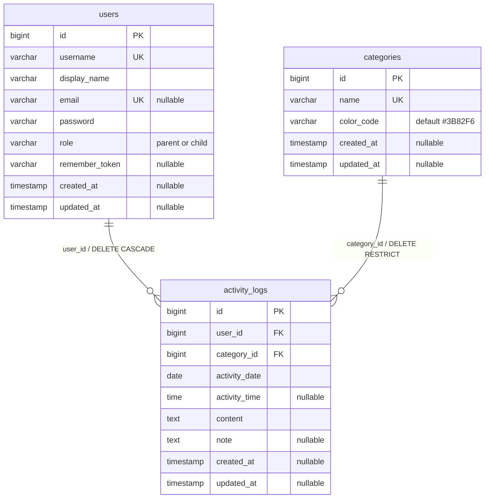
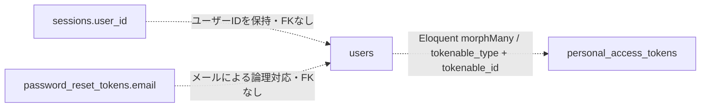

# 現行データモデル仕様（v0.9.0設計の事前資料）

確認日：2026-09-28。複数家族対応・リワードのモデル素案を検討するため、現行の実装とローカルDBを整理した資料。新モデルの提案・確定仕様ではない。

## 調査根拠と確認範囲

- 基準コミット：`4957116`（v0.9.0要件整理）。今回の開発ではmigration・モデルを変更していない。
- WindowsローカルのLaravel 13.32.0、PostgreSQL接続、`public`スキーマを読み取りで確認した。
- `backend/`で `php artisan migrate:status --no-interaction` を実行し、リポジトリの6 migrationが適用済みであることを確認した。
- 各テーブルに `php artisan db:table <table> --json --no-interaction` を実行し、型・NULL・既定値・索引・外部キーを確認した。
- 全12テーブルの詳細な実測結果は[スキーマスナップショット](current-db-schema.json)に保存した。レコード、接続先、認証情報は含まない。
- 実装の根拠：[migrations](../../../backend/database/migrations/)、[Models](../../../backend/app/Models/)、[API controllers](../../../backend/app/Http/Controllers/Api/)、[ActivityLogPolicy](../../../backend/app/Policies/ActivityLogPolicy.php)、[API routes](../../../backend/routes/api.php)。
- 商用・ステージングDBは未照合。商用の専用スキーマとローカルの`public`は異なるため、この資料を商用の実測結果とは扱わない。
- `db:table`はCHECK制約を出力しない。`role`の列挙制約はmigration定義に基づく記述であり、実DBのCHECK制約そのものは未照合。

## 現行の業務モデル

全アカウントが一つの集合として利用する。親・子は `users.role` で区別し、親子間の直接の所属関係は保存しない。家族ID・家族名・家族メンバーシップ・リワード・インベントリのテーブルは存在しない。

この図の実線はDB外部キーで保証する関係。ユーザー1件に0件以上の履歴、カテゴリ1件に0件以上の履歴が属し、履歴は必ず各1件を参照する。外部キー更新時はいずれも`NO ACTION`。

## 業務テーブルの仕様

`NULL可`の「可」はNULLを保存可能という意味。「—」は既定値なし。`timestamp`はPostgreSQLの`timestamp(0) without time zone`、`time`は`time(0) without time zone`。IDは`bigint`のシーケンス採番である。

### users

| 列 | DB型 | NULL可 | 既定値 | 用途・制約 |
| --- | --- | --- | --- | --- |
| id | bigint | 不可 | シーケンス | 主キー |
| username | varchar(255) | 不可 | — | 全体で一意。ログインID |
| display_name | varchar(255) | 不可 | — | 表示名 |
| email | varchar(255) | 可 | — | 全体で一意。ログインにも使用。NULLは複数許容 |
| password | varchar(255) | 不可 | — | ハッシュを保存 |
| role | varchar(255) | 不可 | child | migrationでparent/childを列挙 |
| remember_token | varchar(100) | 可 | — | Laravelの認証用列 |
| created_at | timestamp | 可 | — | Eloquentが作成時に設定 |
| updated_at | timestamp | 可 | — | Eloquentが更新時に設定 |

- 索引：`users_pkey(id)`、`users_username_unique(username)`、`users_email_unique(email)`。
- DBの文字数とAPIの上限は同じではない。ユーザー作成・更新の`username`、`display_name`は50文字、`email`は255文字まで。
- ユーザー作成APIは親のみ利用可能。`role`にはparentとchildの両方を指定できる。現行UIの「新しい家族を追加」は家族テナントの作成ではなくユーザーの追加。
- `User::isParent()`はroleの判定だけであり、家族境界や作成者を見ない。
- `User::activityLogs()`は`user_id`によるhasMany。SoftDeletesは使用せず、`deleted_at`列もない。
- **親がユーザーを削除するとDBのCASCADEにより、そのユーザーの活動履歴も物理削除される。** 自分自身の削除はAPIで拒否する。課題5の論理削除方針は未実装。

### categories

| 列 | DB型 | NULL可 | 既定値 | 用途・制約 |
| --- | --- | --- | --- | --- |
| id | bigint | 不可 | シーケンス | 主キー |
| name | varchar(255) | 不可 | — | 全体で一意 |
| color_code | varchar(7) | 不可 | #3B82F6 | 色。APIで6桁HEXを検証 |
| created_at | timestamp | 可 | — | 作成日時 |
| updated_at | timestamp | 可 | — | 更新日時 |

- 索引：`categories_pkey(id)`、`categories_name_unique(name)`。
- 作成者・所有者・家族IDはなく、全ユーザー共通。
- 親だけが作成・更新・削除できる。履歴が存在するカテゴリの削除はAPIで422、DB外部キーでもRESTRICT。
- `Category::activityLogs()`は`category_id`によるhasMany。
- APIは`color_code`をnullableで検証する一方、DB列はNOT NULL。明示的なnullを送る場合の不整合は現行の注意点であり、この調査で仕様変更はしない。

### activity_logs

| 列 | DB型 | NULL可 | 既定値 | 用途・制約 |
| --- | --- | --- | --- | --- |
| id | bigint | 不可 | シーケンス | 主キー |
| user_id | bigint | 不可 | — | users.id。削除時CASCADE |
| category_id | bigint | 不可 | — | categories.id。削除時RESTRICT |
| activity_date | date | 不可 | — | 実施日 |
| activity_time | time | 可 | — | 実施時刻 |
| content | text | 不可 | — | 活動内容。API上限1000文字 |
| note | text | 可 | — | 補足。API上限1000文字 |
| created_at | timestamp | 可 | — | 登録日時 |
| updated_at | timestamp | 可 | — | 更新日時 |

- 索引：`activity_logs_pkey(id)`、`activity_logs_activity_date_user_id_index(activity_date, user_id)`。ローカルPostgreSQLにはuser_id単独・category_id単独の索引はない。
- 外部キー：`activity_logs_user_id_foreign`、`activity_logs_category_id_foreign`。
- 作成時のuser_idは認証ユーザーから設定する。APIから任意の投稿者として作成できない。
- 一覧・詳細の閲覧は全認証ユーザーに許可し、編集・削除は本人のみ。親にも他者の履歴の編集・削除は許可していない。
- カテゴリは全体の存在確認のみ。家族スコープはない。
- 実施日と登録日時は別属性。同一ユーザー・同一日に複数登録でき、一意制約はない。
- Eloquentの返却形式は実施日`Y-m-d`、時刻`H:i`。期間フィルターは実施日のfrom/to両端を含む。
- 一覧は実施日・時刻・登録日時の降順、50件単位。カレンダー件数はフロントエンドが取得した履歴から集計する。

## 認証関連の関係（外部キーなし）

点線はDB外部キーではない関連。孤立した関連行の削除や整合性がDBで自動保証されるわけではない。

### personal_access_tokens

| 列 | DB型 | NULL可 | 既定値 |
| --- | --- | --- | --- |
| id | bigint / PK | 不可 | シーケンス |
| tokenable_type | varchar(255) | 不可 | — |
| tokenable_id | bigint | 不可 | — |
| name | text | 不可 | — |
| token | varchar(64) / UNIQUE | 不可 | — |
| abilities | text | 可 | — |
| last_used_at | timestamp | 可 | — |
| expires_at | timestamp | 可 | — |
| created_at / updated_at | timestamp（各列） | 可 | — |

索引は主キー、tokenの一意索引、`(tokenable_type, tokenable_id)`の複合索引、expires_atの索引。外部キーはない。Sanctumの `User::tokens()` で関連付け、ログイン時に既存トークンを削除して30日有効のトークンを作成し、ログアウト時は現在のトークンを削除する。現行ユーザー削除APIにトークン明示削除はなく、DBの連鎖削除もない。

### password_reset_tokens / sessions

| テーブル | 列と型（`?`はNULL可） | 主キー・索引 | 既定値 |
| --- | --- | --- | --- |
| password_reset_tokens | email varchar(255)、token varchar(255)、created_at timestamp? | email PK | 全列なし |
| sessions | id varchar(255)、user_id bigint?、ip_address varchar(45)?、user_agent text?、payload text、last_activity integer | id PK、user_id・last_activityに各索引 | 全列なし |

`sessions.user_id`はmigrationでforeignIdを使用するが、`constrained()`がないため外部キーはない。パスワード再設定用テーブルは存在するが、現在のAPI routesにメールによるパスワード再設定の導線はない。フロントの認証はBearerトークンを用いる。

## フレームワーク用テーブル

これらを家族の業務テーブルとして扱わない。以下の型・NULL・索引はローカル実測、列ごとの詳細はJSONを参照する。`?`以外はNOT NULL。主キーはすべて一意。

| テーブル | 列と型 | 主キー・追加索引 | 既定値 |
| --- | --- | --- | --- |
| cache | key varchar(255)、value text、expiration bigint | key PK、expiration索引 | なし |
| cache_locks | key varchar(255)、owner varchar(255)、expiration bigint | key PK、expiration索引 | なし |
| jobs | id bigint、queue varchar(255)、payload text、attempts smallint、reserved_at integer?、available_at integer、created_at integer | id PK、queue索引 | idのみ採番 |
| job_batches | id varchar(255)、name varchar(255)、total_jobs integer、pending_jobs integer、failed_jobs integer、failed_job_ids text、options text?、cancelled_at integer?、created_at integer、finished_at integer? | id PK | なし |
| failed_jobs | id bigint、uuid varchar(255)、connection varchar(255)、queue varchar(255)、payload text、exception text、failed_at timestamp | id PK、uuid UNIQUE、(connection, queue, failed_at)索引 | id採番、failed_atはCURRENT_TIMESTAMP |
| migrations | id integer、migration varchar(255)、batch integer | id PK | idのみ採番 |

いずれも外部キーなし。migration中のlongText/mediumTextはPostgreSQLではtext、unsigned指定の数値も実測型はsmallint/integer/bigintとなっている。`migrations`はLaravelが管理用に作成するテーブルで、アプリの6 migrationの中には定義されない。

## モデル素案を検討する際の現行制約

以下は検討材料であり、新モデルの解決案を確定するものではない。

1. 所属・家族名・作成親の情報が現在はない。既存全データをどう家族へ帰属させるか定義が必要。
2. ユーザー名・メール・カテゴリ名は現在グローバル一意。ログインIDの一意性と家族内カテゴリの一意性は分けて検討する。
3. 親の管理権限と一覧APIに家族境界がない。ユーザー・カテゴリ・履歴・パスワード変更の全経路が対象となる。
4. 履歴の実施日・登録日時・複数回登録は別々の概念。リワード集計対象日、同日重複、後日編集・削除の扱いが必要。
5. ユーザー削除で履歴は消える一方、トークン等はDBで連鎖削除されない。退会・論理削除・獲得履歴保持の整合性を検討する。
6. 現行モデルはカテゴリとユーザーの家族一致を検証する構造を持たない。所属を追加した後は、API入力とDB整合性の両面を検討する。

ユーザーからのモデル素案を受け取った後、[v0.9.0詳細要件](../../issues/v0.9.0.md)の設計論点と照合して対話で更新する。現時点では新テーブル・migration・移行処理を作成していない。
