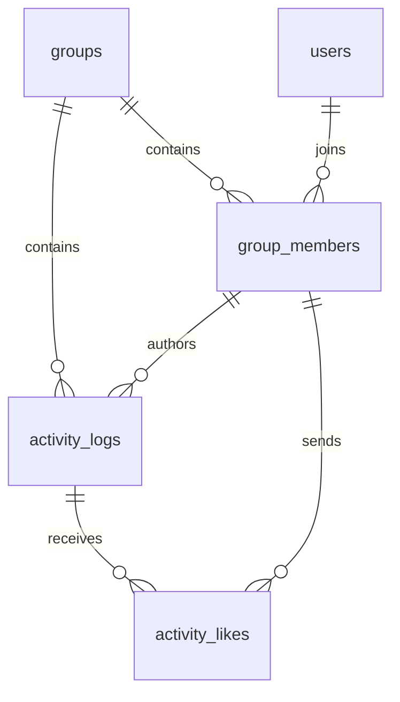

# v0.13.0 詳細要件 — いいね・表示改善・サービス紹介

作成日：2026-10-07。作業ブランチ：`feature/v0.13.0`。
状態：2026-10-08に商用公開。ローカル・ステージング・本番の自動検証とユーザー実機確認に合格。[公開記録](../operations/change-log/2026-10-08-v0130-release-notes.md)を参照。

## 1. 目的・範囲

家族の活動に気軽に反応できる「いいね」を追加し、表示上の不便を改善する。リポジトリの入口を開発ガイドからサービス紹介へ変更する。

原案：ローカルメモ `.tools/ka2_memo.md` の「v0.13.0 の対応候補」1〜5。本文書は原案を参照できない環境でも読めるよう要件を記載する。

| ID | 対象 | 今回の成果 |
| --- | --- | --- |
| R1 | 初期読み込みのタブアイコン | 初期HTMLからFamieアイコンを表示 |
| R2 | 表示名の敬称 | 設定画面から固定ヘッダの「さん」を切り替え |
| R3 | カテゴリ編集の案内 | 編集できる管理者向けヘルパーテキスト |
| R4 | いいね | 家族内の他者の活動への追加・解除、件数表示、集計可能なDB設計 |
| R5 | README | 英語のサービス紹介、既存開発ガイドの整理・移動、サンプル画面画像 |

対象外：リワード定義・判定・付与・インベントリ、決済、複数家族への同時所属・招待・切替、お知らせ・タスク・プッシュ通知、いいねした人の一覧、ランキング、リアルタイム配信。将来要望は今回の実装範囲に含めない。

## 2. 調査根拠・既存仕様

本節は実装着手前のソースとmigrationに基づく調査記録。実装後の結果は第10節を参照。商用環境の実測ではない。

- [家族モデル設計](../development/group-model-extension-spec.md)の家族境界、所属の無効化・復元、ロック取得順を引き継ぐ。現在は1ユーザー1家族。
- [活動API](../../backend/app/Http/Controllers/Api/ActivityLogController.php)は家族と投稿者のactive所属で絞り込む。無効化済み投稿者の記録は一覧・詳細とも非表示。活動の編集・削除は本人だけ。
- 活動は `activity_logs.group_id / user_id / category_id / activity_date` を持つ。家族と投稿者・カテゴリの整合性は複合外部キーで保証されている。
- [初期設定](../../frontend/nuxt.config.ts)は `ssr: false` と専用読み込みテンプレートを使用。`rel="icon"` は [app.vue](../../frontend/app/app.vue) の実行時に設定され、初期HTML向けの設定にはない。`public/favicon.ico` も存在するため、実装時にフォールバックの内容を確認する。
- [タイムライン](../../frontend/app/pages/index.vue)は本人の編集リンクの疑似要素でカード全体を覆う。操作領域の追加時に干渉を確認する。
- 現行READMEはFamieを開発ガイドとして説明し、構成例に `other/` を含む。サービス説明・実際の構成と整合するよう整理する。
- `knowledge/current-data-model-spec.md` はv0.9.0時点の事前資料であり、現在の家族モデルの正本として扱わない。

## 3. R1：初期アイコン

- 「Famie を読み込んでいます…」の表示中から、読み込み完了後と同じFamieアイコンをタブに表示する。
- JavaScriptの起動前に配信されるHTMLのheadにアイコンを指定する。実行時の指定と競合・重複しない構成にする。
- 自動取得される `favicon.ico` もFamieに揃える。既存の `icon.svg` を元資産として利用し、PWA・Apple用アイコンとの整合を保つ。
- 通常起動、ログインURLへの直接アクセス、低速通信、キャッシュなし、旧版からの更新を確認する。ブラウザ自身のアイコンキャッシュの更新時期と、配信HTML・資産の正しさは区別する。

## 4. R2：敬称の表示設定

本人アカウントへの保存・全端末の固定ヘッダへの適用・初期ONは、2026-10-07にユーザー合意済み。具体的な保存・更新方式は以下とする。

- 設定の「ログイン情報」で表示名変更欄の下に「ヘッダの名前に『さん』を表示する」スイッチを置く。初期値はON。
- `users.show_name_suffix` をboolean・NOT NULL・既定値trueで追加し、既存ユーザーも現在の表示を維持する。
- 本人の設定として保存し、再ログイン・他端末でも本人情報の取得時に反映する。他端末へ即時配信はしない。
- 対象は固定ヘッダのみ。他画面の敬称、家族が閲覧する表示名、保存済み `display_name` 自体は変更しない。「おとうさん」等の文字列から自動判定しない。
- 切り替え時に即時保存する。送信中は再操作を止め、成功時に本人情報とヘッダを更新する。失敗時は保存済み状態へ戻して日本語で再試行を案内する。
- 既存 `PATCH /v1/auth/me` を拡張し、表示名・敬称設定の部分更新を許可する。省略項目は変更しない。少なくとも一項目を要求し、不明な項目・不正な型を拒否する。表示名の既存検証は維持する。
- ログイン・登録・本人情報取得・本人情報更新の本人情報レスポンスに設定値を含める。親でも他者のこの設定は変更できない。
- 表示名編集中にスイッチを操作しても、未保存の表示名を送信・上書きしない。表示名の保存が敬称設定を巻き戻さないよう応答を反映する。
- スイッチを共通コンポーネント化する。値・ラベル・無効状態・処理中表示・変更通知を扱い、API通信は親画面で担当する。キーボード操作、フォーカス、読み上げのON/OFF状態を提供する。既存の無関係なUIは一括置換しない。

## 5. R3：カテゴリ編集案内

- 設定の「カテゴリ」でバッジ一覧に隣接して「カテゴリのバッジを押すと、名前や色を編集できます。」と表示する。
- 現在の家族でactive adminの利用者だけに表示する。一般メンバーには編集操作を案内しない。
- カテゴリが0件のときはバッジ操作の案内を出さない。既存の追加・編集・削除権限は維持する。

## 6. R4：いいねの業務ルール

- ログイン中で対象家族にactive所属する人は、同じ家族の他者の表示可能な活動へいいねできる。admin/memberの違いはない。
- 自分の活動へのいいねは禁止。adminによる代理いいね・他者のいいね解除も禁止する。
- 1人が1活動に付けられる有効ないいねは1件。追加・解除を何度でも切り替えられる。回数制限や累積加算は設けない。
- 未ログイン・無効化された本人は操作できない。別家族・不存在・無効化済み投稿者の活動も操作できない。
- 活動の本文・メモ・実施日・カテゴリの編集でいいねを消さない。活動削除時は紐づくいいねを削除する。
- 投稿者の無効化時は活動といいねを保持し、活動を非表示・集計対象外とする。復元時に再表示する。
- **2026-10-07 ユーザー合意済み**：いいねした人の所属無効化時は行を保持し、件数から除外する。復元時に再び含める。画面・API・将来集計で同一の条件を用いる。

### カードの表示・操作

メモの下（メモがなければ本文の下）の同じ行に、左側へハートと件数、右側へ既存の編集ボタンを配置する。編集ボタンは本人にのみ表示する。

| 状態 | ハート | 件数 | 操作 |
| --- | --- | --- | --- |
| 他者の活動・未いいね | グレーのアウトライン | 0を含め表示 | いいねを追加 |
| 他者の活動・いいね済み | 赤の塗りつぶし | 合計を表示 | 自分のいいねを解除 |
| 自分の活動・1件以上 | 薄いピンクの塗りつぶし | 合計を表示 | 表示のみ |
| 自分の活動・0件 | 薄いグレーのアウトライン | 数字は省略 | 表示のみ |

- 指定の `.tools/ka2_svg-icon-list.md` の `heart-outline` / `heart` を既存アイコン資産と同じ方式で取り込む。ローカルメモへの実行時依存は作らない。
- 操作可能なハートはbuttonとし、色だけに依存せず `aria-pressed` と「いいねする／いいねを取り消す」、合計件数を読み上げ可能にする。グレーでも操作可能と分かるフォーカス・押下表現を用意する。
- 自分の活動は押せそうな無効ボタンにせず、非操作の表示とする。「受け取ったいいね：0件」等を読み上げ可能にし、薄色でも意味が失われないようにする。
- ライト／ダーク双方で判別可能にする。操作可能領域は44px以上を確保し、狭い画面でも編集ボタンと重ならない。
- いいね領域を押して編集画面へ遷移しない。既存カード全体の編集導線を保つ場合も、いいね領域の重なりとキーボード操作を分離する。
- タップ直後にアイコンと件数を楽観的に更新し、即座にAPIを送信する。通信完了までその活動のボタンだけ再操作を止め、追加タップを予約・送信しない。成功後にサーバーの件数と状態で更新する。仮表示の加減算を正本にしない。
- 通信失敗時は成功扱いにせず日本語で再試行を案内する。応答喪失時は再取得または同じ希望状態の再送で同期できるようにする。
- 他人の操作は次回取得で反映する。ページ切替・フィルター変更後の古い応答で別の活動や新しい表示を上書きしない。ログアウト・別ユーザーでのログイン時は表示状態を破棄する。

### データモデル

有効ないいね1件を `activity_likes` の1行として保存する。取消時は物理削除し、再追加は新しい行にする。カウンタだけの保存や操作履歴テーブルは採用しない。

**2026-10-08 ユーザー合意済み**：当初のDELETE／INSERT方式を維持し、`is_active` で更新する代替案は採用しない。ただしDELETEも古い行の版を残すため、VACUUM・索引管理・ロック競合への対処は必要。状態列方式より常に高速であるという実測上の判断ではない。

| 列 | 型・制約 | 意味 |
| --- | --- | --- |
| id | bigint、主キー | いいねの識別子 |
| group_id | bigint、NOT NULL | 家族境界 |
| activity_log_id | bigint、NOT NULL | 対象活動 |
| user_id | bigint、NOT NULL | いいねした人。受け取った人ではない |
| created_at | timestamp、NOT NULL | 今回いいねを追加した日時 |
| updated_at | timestamp、NOT NULL | 既存モデルの日時規約に合わせて保持 |

- `UNIQUE(group_id, activity_log_id, user_id)` で重複を防ぐ。
- `activity_logs` に `UNIQUE(group_id, id)` を追加し、`activity_likes(group_id, activity_log_id)` → `activity_logs(group_id, id)` の複合外部キーを張る。活動削除時はCASCADE。
- `activity_likes(group_id, user_id)` → `group_members(group_id, user_id)` の複合外部キーを張り、所属削除はRESTRICT。対応する索引 `(group_id, user_id)` を用意する。
- 以上により別家族の活動・所属の組み合わせをDBでも拒否する。active所属と自己いいね禁止は関連行を確認する業務処理で保証する。
- `ActivityLike` はActivityLog・User・Groupに属する。ActivityLogは複数のいいねを持ち、Userの送信したいいねと、本人の活動が受信したいいねは区別する。
- 受信者・カテゴリ・実施日は活動から取得し、いいね側へ重複保存しない。家族ID・投稿者IDを編集不可とする既存仕様を維持する。
- 集計は家族・実施日・受信者・カテゴリで活動を絞り、いいねを結合する。既存の `(group_id, activity_date, user_id)` 索引を起点とし、追加索引は実装時に実行計画を確認して判断する。
- いいね件数を `users` や `activity_logs` の列へキャッシュしない。一覧取得は集合的な件数・本人状態取得で処理し、活動ごとの追加クエリを発生させない。

所属と活動・いいねの関係は `group_id + user_id`、活動といいねの関係は `group_id + activity_log_id` で保証する。

### API契約

既存 `/v1/groups/{group}/logs` 配下へ追加する。認証・家族所属確認は既存方式を利用する。

| API | 動作 | 成功応答 |
| --- | --- | --- |
| `PUT /v1/groups/{group}/logs/{log}/like` | 本人のいいねを有効にする。既に存在すれば維持 | 200、現在の集計と本人状態 |
| `DELETE /v1/groups/{group}/logs/{log}/like` | 本人のいいねを解除する。存在しなくても成功 | 200、現在の集計と本人状態 |

- UIは切替操作でも、APIは希望状態を明示する。単一のtoggle APIは使わず、再送で状態が反転しないようにする。
- 書き込みbodyは不要。`user_id / group_id / likes_count` 等のクライアント指定は拒否し、認証本人・URL・DBから決める。
- 成功応答は `data: { id, likes_count, liked_by_me, can_like }`。`id` は活動ID、件数は整数、残り2項目はboolean。
- 活動の一覧・詳細・作成・更新レスポンスにも `likes_count / liked_by_me / can_like` を含める。既存のページング・絞り込み・並び順を維持する。新規活動は0件。
- 未ログインは401、操作本人の所属・家族アクセス拒否は既存方式の404、許可された家族内で対象活動が不存在・別家族・投稿者無効なら404、自分へのいいねは403、不正入力は422とする。無効化でトークンが失効している場合は401となる。
- 同時PUTで重複しないこと、同時PUT/DELETEが一貫した順序で確定することを保証する。複数端末では最後に処理された希望状態を採用する。
- 既存方針のグループ→所属（複数ならID順）→活動の順でロックし、トランザクション内で本人・投稿者のactive状態と所有者を再確認する。件数も書き込み後の同じ処理で取得する。
- 所属無効化との競合、活動削除との競合を検証する。削除済みへの追加は404とし、孤立行・重複行・整合性違反による未処理500を残さない。

### 頻繁な切り替えへの対策（2026-10-08 方針合意）

保存方式に加え、デバウンスを採用せず「楽観的UI＋通信完了まで無効化」とする方針をユーザーと合意した。レート制限値は環境変数で調整できるようにし、実操作の検証で最終調整する。以下に実装・検証方針を記載する。

- ON要求は初回・再追加・再送とも `INSERT ... ON CONFLICT (group_id, activity_log_id, user_id) DO NOTHING` とし、いいね行の存在を事前SELECTして分岐しない。家族境界・所属状態・自己いいね禁止の検証と、既定のトランザクション・ロックは省略しない。
- OFF要求は家族・活動・認証本人の3条件でDELETEし、0件削除も正常終了とする。SQLへ渡す投稿対象と本人情報は認可済みの値を使用する。INSERTにはNOT NULLの `created_at / updated_at` を両方設定する。
- 同じONまたはOFFの反復に対して冪等であることと、ON/OFF混在の到着順を保証することは別。UIは活動ごとに同時送信を1件に限定する。既定のロックは処理順を直列化するが、複数端末でタップした時刻の順序までは保証しない。
- UIは「楽観的表示＋通信完了まで再操作禁止」とする。アイコンと件数を一時的に反転し、成功応答で正規化する。確定した失敗では元の表示へ戻して通知する。固定500msの最低クールダウンは必須とせず、通信完了を操作再開の基準とする。429と応答不明時は後述の待機・同期処理に従う。
- タイムアウト・切断・一部のサーバーエラーは、DBの未更新を意味しない。応答不明時は表示を未確認として扱い、反対操作を並行送信せず、同じ希望状態の再送で同期する。再取得だけでは先行書き込みが処理中の可能性もある。再試行を無制限に行わず、旧リクエストが遅れて完了するケースを検証する。
- 初期実装ではデバウンス・スロットルによる遅延送信や最終状態のまとめ送りを採用しない。
- API側はPUT／DELETEで共通の認証ユーザーID別レート制限を設け、業務トランザクション開始前に適用する。同一ユーザーの全カード・全端末のいいね操作を合算し、取得APIや他機能の上限とは分離する。複数ワーカー・サーバーでも制限を共有できる方式とする。
- 制限値はBackendの環境変数 `FAMIE_LIKE_RATE_LIMIT_PER_SECOND` とし、既存の `config/famie.php` に設定を集約する。単位は1秒あたりのリクエスト件数、正の整数のみを許容する。未設定時の初期値は2とし、0・負数・非整数等は設定エラーとして扱い、意図せず無制限にしない。実装時に `.env.example` と運用手順へ設定方法・設定の再読込手順を記載する。
- 秒間2件は初期検証値であり、最終的な上限は異なるカードの連続操作・複数端末・低速通信を含む実操作で調整する。応答時間・429頻度・DBのロック待ちを記録し、採用値と理由を検証記録に残す。
- 429時は楽観的表示を戻し、サーバーの `Retry-After` に基づいて待機時間を案内する。同じユーザーの別カードへ操作して制限に繰り返し当たらないよう、画面内の操作可能ないいねボタンにも待機状態を共有する。即時自動再送を繰り返さない。
- 家族行ロックは同じ家族の別活動への操作も直列化するため、トランザクションを短くし、外部通信を含めない。ロック取得順を統一し、待機時間とデッドロックを検証する。いいね行が未作成の場合もあるため、いいね行のロックだけで代用しない。
- PostgreSQLで重複ON、重複OFF、ON/OFF交互、応答喪失、無効化／削除との競合を検証する。応答時間、ロック待ち、dead tuple推定数、autovacuum実行状況を確認し、必要な場合のみテーブル単位の設定を調整する。定期的なVACUUM FULLを前提にしない。

技術的根拠：[PostgreSQL INSERT／ON CONFLICT](https://www.postgresql.org/docs/14/sql-insert.html)、[通常のVACUUM](https://www.postgresql.org/docs/14/routine-vacuuming.html)、[ロックとデッドロック](https://www.postgresql.org/docs/14/explicit-locking.html)。実装時には利用するDBバージョンでも確認する。

### リワードへ接続する集計の意味

**2026-10-07 ユーザー合意済み**：指定期間に実施した活動が、現在受けているいいねの合計を用いる。いいねされた日時の期間集計や累積押下回数ではない。

- 家族を必須条件とし、受信者は `activity_logs.user_id`、期間は `activity_date` の開始日・終了日を両端含み、カテゴリは現在の `category_id` で絞る。
- 例：10月の勉強記録に11月に付いたいいねも、現在10月分を集計すると含まれる。10月に付けたいいねでも9月の活動なら10月分には含めない。
- 解除で減り、再追加で1件に戻る。同じ人のオン／オフ操作による水増しはできない。
- 日付・カテゴリを編集すれば該当集計先も変わる。活動削除は集計から除外。所属無効化の条件は上記の確定ルールに従う。
- 期間外への編集・削除・いいね解除による減少は、将来の達成判定にも影響し得る。獲得済み報酬の取消・確定時点の証跡保存はリワード実装時に別途決める。本モデルだけでは過去時点の件数を再現できない。
- v0.13.0ではこの意味で集計可能なモデル・検証を用意する。集計の公開API、集計画面、報酬条件用の列・テーブルは先行実装しない。

## 7. R5：README・開発ガイド・画面画像

- ルート `README.md` を英語のサービス紹介へ書き換える。Famieを家族の日々の活動を記録・共有し、互いの活動を応援するサービスとして説明する。
- 対象利用者、タイムライン・期間／家族／カテゴリの絞り込み・いいね・家族管理・PWA・表示テーマ等の実装済み機能、画面画像、開発資料への導線を簡潔に記載する。
- 画面は日本語のままでよい。英語READMEを理由にアプリの英語対応まで範囲を広げない。未実装のリワード・複数所属を利用可能な機能として紹介しない。
- 現READMEの開発情報は `docs/development/workspace-guide.md` に整理・移動する。実在する構成、Windows環境、定義済みコマンドへ合わせる。AGENTS.mdや既存リリース手順との重複はリンクに置き換える。
- `docs/development/README.md` から移動先へリンクする。旧READMEの内部アンカー・参照元を調べ、移動によるリンク切れを解消する。
- v0.13.0の画面実装後、既存Playwright環境を利用して紹介用のタイムライン画像を撮影する。
- 架空の家族・カテゴリ・活動・いいねを使う。固定の日付と再現可能なテストデータ／API fixtureで構成し、実ユーザーの記録・メール等を写さない。
- 画像はスマートフォン相当のライト表示を主画像とし、複数メンバー・カテゴリ・メモ・いいねが自然に見える構成にする。文字が読める大きさで、読み込み・エラー・開発ツールを含めない。
- 保存先は `docs/assets/screenshots/timeline-v0.13.0.png` を予定する。英語の代替テキストと、サンプルデータである旨をREADMEへ記載する。撮影条件・再生成方法も開発ガイドに残す。

## 8. 移行・実装順序・検証

### 移行と互換性

- migrationで敬称設定と空のいいねテーブル・必要な制約を追加する。既存の活動・所属・カテゴリ・ユーザー識別子は変更しない。
- 既存活動はいいね0件、既存ユーザーは敬称ONから開始する。テスト用いいねを通常DB・公開環境へ投入しない。
- API追加は旧フロントからの操作を維持し、既存の表示名だけの更新を受け付ける。フロントの型・fixtureも追加項目に対応させる。
- 配置は既存リリース手順に従う。migration前に新APIを利用させない。データ蓄積後に新テーブルを落として切り戻す運用は避け、バックアップ・復旧手順を実装時に記載する。
- `version.json` は実装開始時に `current: 0.12.0 / next: 0.13.0` に設定済み。packageの更新は既存リリース準備スクリプトに任せる。

### 実装順序

1. 本文書の未確定事項を解消し、要件を合意する。
2. いいねDB・API・集計条件と敬称設定の永続化を実装・検証する。
3. タイムライン、設定UI、初期アイコンを実装し、既存操作との干渉を確認する。
4. 完成画面からサンプル画像を撮影し、READMEと開発ガイドを更新する。
5. ステージング・実機確認を行い、既存のPR・リリース手順に進む。

### 受入条件

| 対象 | 確認内容 |
| --- | --- |
| いいね基本 | 親・子とも他者へ追加・解除できる。本人への操作拒否、0/1/複数件の表示、再読込後の維持 |
| 家族境界 | 他家族ID・活動ID・所属の組み合わせをAPIとDBで拒否。代理操作・他者解除を拒否 |
| データ整合 | 二重追加、解除の再送、同時追加／解除、活動削除、所属無効化／復元との競合 |
| 集計 | 実施日の期間境界、受信者・カテゴリ・家族の分離、取消・再追加・編集・削除・無効化／復元 |
| 一覧 | 既存50件ページング・フィルター維持、件数と本人状態が正しい、活動件数に比例する追加クエリなし |
| カードUI | メモ有無、自己／他者、通信失敗、連打、編集リンクとの干渉、狭幅、両テーマ、読み上げ・キーボード |
| 送信・レート制限 | 即時の仮表示、通信中の再送なし、成功時の正規化、失敗時の復元、応答不明時の同期、環境変数の既定値・変更・不正値、PUT／DELETE・複数端末の共通上限、429の待機・復帰 |
| 敬称 | 既存／新規ユーザー初期値、ON/OFF、再ログイン・別端末、保存失敗、未保存表示名との独立性、他者更新拒否 |
| カテゴリ | adminのみ案内表示、一般メンバー・カテゴリ0件では非表示、既存編集が動作 |
| アイコン | 初期HTMLと資産、JS起動前・低速通信、公開用静的成果物、旧PWAからの更新 |
| README | 英語のサービス説明、実装と一致した機能一覧、再現可能なサンプル画像、リンク切れなし |

- 最小範囲のLint・型チェック、Backendの該当機能テスト、Frontendの関連Playwrightテストを実施する。DB制約・同時実行はPostgreSQLでも検証する。
- アイコンは開発サーバーだけで判定せず、静的生成された初期HTMLと配信資産を確認する。
- iPhone Safari／ホーム画面PWAで押下領域、スクロール、編集との干渉、テーマ、更新後の状態を確認する。
- 要件合意・実装・自動検証・実機確認・公開を分けて記録する。

## 9. 判断事項・進捗

| 論点 | 方針 | 状態 |
| --- | --- | --- |
| リワード向け集計 | 対象期間の活動に対する現在の受信いいね数 | 2026-10-07 ユーザー合意済み |
| いいね送信者の無効化 | 行を保持して集計から除外、復元時に再集計 | 2026-10-07 ユーザー合意済み |
| 敬称の保存・適用範囲 | 本人アカウントで全端末共通、固定ヘッダのみ、初期ON | 2026-10-07 ユーザー合意済み |
| 自分の活動のハート | 非操作表示、0件は薄灰ハートのみ、1件以上は薄桃ハート＋件数 | 2026-10-08 ユーザー承認済み |
| DB・API・共通スイッチ・画像仕様 | 本文の設計を採用 | 2026-10-08 ユーザー承認済み |
| いいね保存方式 | DELETE／INSERTを維持。is_active案は不採用 | 2026-10-08 ユーザー合意済み |
| いいねUIの送信制御 | 楽観的UI＋通信完了まで無効化。初期実装ではデバウンスなし | 2026-10-08 ユーザー合意済み |
| レート制限 | 秒間上限を環境変数化。初期値2、実操作で最終調整 | 2026-10-08 方針合意。設定名・初期値・エラー処理は本書で具体化 |
| その他の切り替え対策 | ON CONFLICT、競合検証、運用監視 | 本書の実装・検証方針 |

- [x] 原案・既存実装の調査
- [x] 詳細要件書の作成
- [x] 集計・無効化・敬称設定の回答反映・合意
- [x] 詳細設計案のレビュー
- [x] Backend実装・ローカル自動検証
- [x] Frontend実装・ローカル自動検証
- [x] README・開発ガイド・サンプル画像
- [x] ステージング・実機確認
- [x] リリース・商用確認

## 10. 実装・検証記録（2026-10-08）

ユーザーによるローカル動作確認とREADMEを含むドキュメント確認は完了。公開サイトへのリンク追加も確認済みで、ステージングリリース工程への移行が承認された。ステージング実機確認は配置後に別途行う。

R1〜R5を `feature/v0.13.0` に実装した。いいねは複合外部キー・一意制約、明示的なPUT／DELETE、active所属での集計、ユーザー単位の共通レート制限を採用。一覧の集計サブクエリには活動IDと家族IDを指定し、複合索引を利用できる形にした。活動数に比例してクエリ数が増えないことをテストした。

UIは楽観的更新と通信完了までの無効化を実装。応答不明時は同じ希望状態で再同期し、429では全カードの待機を共有する。一覧再取得と更新応答の順序は単調増加する番号で管理し、古い一覧で更新結果を巻き戻さない。ログアウト後の遅延応答も破棄する。

家族アクセス拒否のHTTPステータスは、既存の所属ミドルウェアが家族の存在を開示しない404を返すため、設計案にあった403の記述を404へ訂正した。自己いいねは403を維持する。

| 検証 | 結果 |
| --- | --- |
| Backend全体（SQLite） | 117件成功、573 assertions。PostgreSQL専用31件はスキップ |
| 分離したPostgreSQL 14での関連検証 | 63件成功、1618 assertions。PUT／DELETE同士、所属無効化・活動削除との競合を含む |
| 集計クエリ調整後のPostgreSQL再検証 | ActivityLikeTest 10件成功、83 assertions |
| Frontend関連E2E（Chromium／WebKit） | 39件成功、画像撮影のWebKit 1件は対象外。実Laravel APIでの追加・解除・再ログインも検証 |
| 応答順序制御の最終変更後 | いいね・表示設定の関連E2E 14件成功。画像撮影2件は通常実行の対象外 |
| 静的成果物 | 最終 `pnpm build` 成功、配信テスト22件成功。公開API確認2件はローカル実行では対象外 |
| 静的検査 | 変更対象のPint・Biome、Frontend型チェック成功 |

通常のローカルDBはバックアップ後にmigrationを適用した。未適用だったv0.12.0のメール関連migrationも併せて適用し、既存ユーザー・家族・所属・カテゴリ・活動の件数が変わらないことを確認した。通常DBにはサンプルデータを投入していない。バックアップと検証用DBはGit管理外の `.temp/` に保存した。

[紹介画像](../assets/screenshots/timeline-v0.13.0.png)は架空データで生成済み。[開発ガイド](../development/workspace-guide.md)に再生成方法、[Backend運用手順](../operations/runbooks/howto_release_backend.md)に設定反映・移行・復旧・DB監視を記載した。

ローカル実装完了時点では、ステージング配置・実機確認・商用公開は未実施だった。その後の結果は第11節に記録する。実負荷での応答時間・ロック待ち・autovacuumの継続観測は運用で扱う。

## 11. 公開・実機確認（2026-10-08）

- [実装PR #73](https://github.com/ka215/famie/pull/73)をdevへ統合し、[Release CI](https://github.com/ka215/famie/actions/runs/37719257232)で固定成果物を生成。Backend 117件、全体E2E 106件、静的配信22件が成功した。
- [ステージング配置](https://github.com/ka215/famie/actions/runs/37719947782)とリモートブラウザ検証20件が成功。ユーザーから実機確認「問題なし」の回答を受け、本番へ進めた。
- [本番PR #74](https://github.com/ka215/famie/pull/74)をmainへ統合。source treeの一致を確認して `v0.13.0` を付与し、ステージングと同一成果物を[本番配置](https://github.com/ka215/famie/actions/runs/37767550628)した。
- 両環境でDBバックアップ後、いいねテーブルと敬称設定のmigrationを適用。既存データ・環境設定を保持し、サンプルデータは投入していない。
- 本番リモートブラウザ検証20件が成功。ユーザーの本番実機確認も合格し、リリース事後工程への移行を承認された。
- レート制限の設定変更は行わず、初期値2件／秒を維持。実機確認で問題の報告はなく、以後は運用状況に応じて調整する。性能・autovacuumの定量測定を完了したという意味ではない。
- [GitHub Release](https://github.com/ka215/famie/releases/tag/v0.13.0)に同一成果物・SHA256・manifestを登録。main→dev同期後、公開記録・課題一覧・version.jsonを更新する。
